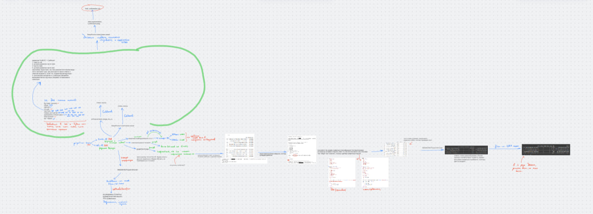
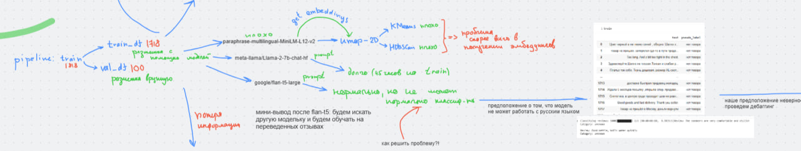

# 📝 Reviews Classification

**Задача**: Разметка товарных отзывов по категориям с использованием **RuBERT**, **XLM-RoBERTa**, **CatBoost** и **LoRA** и обучение модели на размеченных датасетах.

Для улучшения качества на редких классах применялись:
- **Аугментация через back-translation**.
- **Итеративная ручная разметка** порядка десятка примеров.

Результат находится в `reviews-classification/data/final_submission_all.csv`

---

## 📌 Архитектура решения

  
*Рис. 1: Мыслительный роадмап решений,
чтобы его расммотреть более подробно, то скачайте файл* `reviews-classification/mind_roadmap.pdf`,
*то, что обведено зеленым — конечный выбор модели и пайплайна*

---

## 🏷️ Процесс разметки данных

### 🔹 Этап 0: Начальное разделение
- **train_df**: 1717 образцов
- **val_df**: 100 образцов (ручная разметка)

---

### 🔹 Этап 1: Эксперименты с LLM (❌ неудачные)
1. **Llama2 7B (zero-shot)**: Не помещается в Colab.
2. **Flan-T5-large (zero-shot)**: "Галлюцинации".
3. **Helsinki-NLP/opus-mt-ru-en + Flan-T5-large**: Слабая семантика.

  
*Рис. 2: Попытки 1–3 на роадмапе*

---

### 🔹 Этап 2: Первые рабочие подходы
- **Helsinki-NLP/opus-mt-ru-en + Flan-T5-base** → эмбеддинги → **CatBoost**.
- **Accuracy**: ~70% на 50 случайных примерах.
- ⚠️ Проблема: потеря семантики при переводе.

---

### 🔹 Этап 3: Прорыв с русскими эмбеддингами ✅
- **DeepPavlov/rubert-base-cased** и **ai-forever/sbert_large_nlu_ru** → **CatBoost**.
- **Accuracy**: ~70–80%.
- Проблема: дисбаланс классов → решено через `cleaning_datasets.ipynb`.

---

### 🔹 Этап 4: Активное дообучение и ансамбль
**Методология RuBERT + CatBoost**:
1. Первичное обучение на `valid`.
2. Ручная разметка части `train`.
3. Тестирование и поиск сложных кейсов.
4. Дополнительная ручная разметка.
5. **Ансамбль RuBERT + XLM-RoBERTa (zero-shot)** → согласование меток.

Пример логики ансамблирования:
```python
if rubert == xlm:
    final = rubert
elif "текстиль" in [rubert, xlm]:
    final = xlm if not agree else rubert
elif "товары для детей" in [rubert, xlm]:
    final = rubert
else:
    final = rubert
```

**Результат**: Размеченные `train`, `valid`, `test`.  
**Время разметки** `test`: 13:02 (13 минут, 2 секунды).

---

## 🔄 Аугментация редких классов (Back-Translation)

Используется back-translation через случайный язык из `intermediate_languages`. Полученные тексты добавляются в `train` для увеличения выборки редких классов.

```python
import random
import time
from deep_translator import GoogleTranslator

def augment_text(text, variations=3):
    """
    Функция аугментации текста через back-translation.
    """
    augmented_texts = []
    intermediate_languages = ['en', 'de', 'fr', 'es', 'it']

    for i in range(variations):
        try:
            # Случайный выбор промежуточного языка
            intermediate_lang = random.choice(intermediate_languages)

            # Перевод текста на промежуточный язык
            translated_intermediate = GoogleTranslator(
                source='ru',
                target=intermediate_lang
            ).translate(text)

            time.sleep(0.1)

            # Обратный перевод на русский
            back_translated = GoogleTranslator(
                source=intermediate_lang,
                target='ru'
            ).translate(translated_intermediate)

            augmented_texts.append(back_translated)
            time.sleep(0.2)

        except Exception as e:
            print(f"Ошибка при аугментации: {e}")
            augmented_texts.append(text)

    return augmented_texts

train_df_augmented = pd.concat([train, augmented_df], ignore_index=True)
train_df_augmented.to_csv('train_split_augmented.csv', index=False)
```

Полученный `train_df_augmented` был разбит на `train_df` и `valid_df` со стратификацией по классам для сохранения пропорций.

---

## 🤖 Обучение модели с LoRA на аугментированных данных

Используется **LoRA (Low-Rank Adaptation)** для дообучения **RuBERT** на аугментированных данных.

```python
from datasets import load_dataset
from transformers import AutoTokenizer, AutoModelForSequenceClassification, Trainer, TrainingArguments
from peft import LoraConfig, get_peft_model
from sklearn.preprocessing import LabelEncoder
from sklearn.utils.class_weight import compute_class_weight
import torch
import pickle
from sklearn.metrics import f1_score
import numpy as np

# Загружаем аугментированные train и validation данные
dataset = load_dataset('csv', data_files={
    'train': 'train_df_aug.csv',
    'validation': 'valid_df_aug.csv'
})

tokenizer = AutoTokenizer.from_pretrained('DeepPavlov/rubert-base-cased')

# Кодирование меток
label_encoder = LabelEncoder()
train_labels = label_encoder.fit_transform(dataset['train']['pseudo_label_ensemble_final'])
valid_labels = label_encoder.transform(dataset['validation']['pseudo_label_ensemble_final'])

with open('label_encoder.pkl', 'wb') as f:
    pickle.dump(label_encoder, f)

dataset['train'] = dataset['train'].add_column('label', train_labels)
dataset['validation'] = dataset['validation'].add_column('label', valid_labels)

# Токенизация текста
def tokenize_function(examples):
    return tokenizer(examples['text'], padding='max_length', truncation=True, max_length=512)

tokenized_datasets = dataset.map(tokenize_function, batched=True)
tokenized_datasets = tokenized_datasets.remove_columns(['text', 'pseudo_label_ensemble_final'])
tokenized_datasets = tokenized_datasets.rename_column('label', 'labels')

# Вычисление весов классов для балансировки
classes = np.array(train_labels)
class_weights = compute_class_weight('balanced', classes=np.unique(classes), y=classes)
class_weights = torch.tensor(class_weights, dtype=torch.float).to('cuda')

# Инициализация модели и LoRA
model = AutoModelForSequenceClassification.from_pretrained(
    'DeepPavlov/rubert-base-cased',
    num_labels=6,
    device_map='cuda'
)

lora_config = LoraConfig(
    r=32,
    lora_alpha=16,
    target_modules=['query', 'value'],
    lora_dropout=0.4,
    bias='none',
    task_type='SEQ_CLS'
)
model = get_peft_model(model, lora_config)

# Кастомный Trainer с учетом весов классов
class CustomTrainer(Trainer):
    def compute_loss(self, model, inputs, return_outputs=False, num_items_in_batch=None):
        labels = inputs.pop('labels')
        outputs = model(**inputs)
        logits = outputs.logits
        loss_fct = torch.nn.CrossEntropyLoss(weight=class_weights)
        loss = loss_fct(logits, labels)
        return (loss, outputs) if return_outputs else loss

# Функция метрик (F1 по классам и взвешенный)
def compute_metrics(eval_pred):
    logits, labels = eval_pred
    predictions = np.argmax(logits, axis=-1)
    weighted_f1 = f1_score(labels, predictions, average='weighted')
    per_class_f1 = f1_score(labels, predictions, average=None)
    class_names = label_encoder.classes_
    for cls, f1 in zip(class_names, per_class_f1):
        print(f"Class {cls}: F1 = {f1}")
        with open('metrics.txt', 'a') as f:
            f.write(f"Epoch {trainer.state.epoch}: Class {cls}: F1 = {f1}\n")
    with open('metrics.txt', 'a') as f:
        f.write(f"Epoch {trainer.state.epoch}: Weighted F1 = {weighted_f1}\n")
    print(f"Epoch {trainer.state.epoch}: Weighted F1 = {weighted_f1}")
    return {'weighted_f1': weighted_f1}

# Настройки обучения
training_args = TrainingArguments(
    output_dir='./results_lora_1',
    num_train_epochs=20,
    per_device_train_batch_size=16,
    per_device_eval_batch_size=16,
    eval_strategy='epoch',
    save_strategy='epoch',
    load_best_model_at_end=True,
    metric_for_best_model='eval_loss',
    greater_is_better=False,
    learning_rate=1e-4,
    weight_decay=0.01,
    logging_dir='./logs',
    logging_steps=10,
    fp16=True,
    seed=42
)

trainer = CustomTrainer(
    model=model,
    args=training_args,
    train_dataset=tokenized_datasets['train'],
    eval_dataset=tokenized_datasets['validation'],
    compute_metrics=compute_metrics
)

# Отключение WANDB и запуск обучения
import os
os.environ["WANDB_DISABLED"] = "true"
import wandb
wandb.init(mode="disabled")

trainer.train()
```

---

## 🔹 Получение лучшей модели и предсказание теста

```python
from peft import PeftModel
import torch
import pickle
import time
from tqdm import tqdm
from sklearn.metrics import f1_score
from datasets import load_dataset
from transformers import AutoTokenizer, AutoModelForSequenceClassification

# Загружаем токенизатор и модель
tokenizer = AutoTokenizer.from_pretrained('DeepPavlov/rubert-base-cased')
checkpoint_path = './results_lora_1/checkpoint-1632'
model = AutoModelForSequenceClassification.from_pretrained(
    'DeepPavlov/rubert-base-cased',
    num_labels=6
)
model = PeftModel.from_pretrained(model, checkpoint_path)
model = model.to('cuda')

# Загружаем label encoder
with open('label_encoder.pkl', 'rb') as f:
    label_encoder = pickle.load(f)

# Загружаем тестовый датасет
test_df = pd.read_csv('./FINAL_TEST.csv')
test_dataset = load_dataset('csv', data_files={'test': './FINAL_TEST.csv'})

def tokenize_function(examples):
    return tokenizer(examples['text'], padding='max_length', truncation=True, max_length=512)

tokenized_test = test_dataset['test'].map(tokenize_function, batched=True)
tokenized_test = tokenized_test.remove_columns(['text'])

# Предсказания
model.eval()
predictions = []
start_time = time.time()

for i in tqdm(range(0, len(tokenized_test), 16)):
    batch = tokenized_test[i:i+16]
    inputs = {
        'input_ids': torch.tensor(batch['input_ids']).to('cuda'),
        'attention_mask': torch.tensor(batch['attention_mask']).to('cuda')
    }
    with torch.no_grad():
        outputs = model(**inputs)
    logits = outputs.logits
    batch_preds = torch.argmax(logits, dim=-1).cpu().numpy()
    predictions.extend(batch_preds)

# Среднее время предсказания
elapsed_time = time.time() - start_time
avg_time_per_example = elapsed_time / len(test_df)
print(f"Average inference time per example: {avg_time_per_example:.3f} seconds")

# Обратное преобразование меток
predictions = label_encoder.inverse_transform(predictions)
predictions = ['текстиль' if pred == 'обувь' else pred for pred in predictions]

# Метрики
ground_truth = test_df['pseudo_label_ensemble_final'].values
weighted_f1 = f1_score(ground_truth, predictions, average='weighted')
per_class_f1 = f1_score(ground_truth, predictions, average=None)
class_names = sorted(test_df['pseudo_label_ensemble_final'].unique())
for cls, f1 in zip(class_names, per_class_f1):
    print(f"Class {cls}: F1 = {f1}")
print(f"Weighted F1-score on test set: {weighted_f1}")

# Сохранение результатов
test_df['predicted_label'] = predictions
test_df[['Unnamed: 0', 'text', 'pseudo_label_ensemble_final', 'predicted_label']].to_csv('test_predictions.csv', index=False)
with open('test_metrics.txt', 'w') as f:
    for cls, f1 in zip(class_names, per_class_f1):
        f.write(f"Class {cls}: F1 = {f1}\n")
    f.write(f"Weighted F1-score on test set: {weighted_f1}\n")
print("Predictions saved to test_predictions.csv")
print("Metrics saved to test_metrics.txt")
```

---

## 📊 Результаты

- **Среднее время предсказания на объект в** `test`: 0.031 секунды.
- **Weighted F1-score на `test`**: 0.6984.
- Все метрики сохранены в `test_metrics.txt` (для `test`) и `metrics.txt` (для `LoRA`).
- Финальные ответы в соответствующем .csv-формате сохранены в `reviews-classification
/data/final_submission.csv`

---

## 🛠️ Структура репозитория

- **data/**: `FINAL_TEST.csv`, `FINAL_TRAIN.csv`, `FINAL_VALID.csv`, `candidates.xlsx`, `candidates_2_labeled.xlsx`, `final_submission_all.csv`, `test.csv`, `train_1962.csv`, `valid_126.csv`
- **images/**: `photo_2025-09-17_23-55-04.jpg`, `photo_2025-09-18_00-05-27.jpg`.
- **src/**: `finalfinalfinal_combined.ipynb` (объединенные ноутбуки `finalfinalfinal_all.ipynb` и `cleaning_datasets.ipynb`), `finalfinalfinal_all.ipynb` (разметка и обучение), `cleaning_datasets.ipynb` (работа с датасетами)
- **metrics/**: `metrics.txt`, `test_metrics.txt`.
- **LICENCE**: MIT License.
- **README.md**: Документация.
- **mind_roadmap.pdf**: детальная визуализация умственного процесса.

---

## ⚙️ Установка и запуск

**1. Клонируйте репозиторий**:
   - Откройте Google Colab и создайте новый ноутбук.
   - Выполните команду для клонирования репозитория:
     ```bash
     !git clone https://github.com/effes3/reviews-classification.git
     %cd reviews-classification
     ```

**2. Скачайте ноутбук**:
   - Загрузите файл `finalfinalfinal_all.ipynb` из папки `src`:
     ```bash
     !wget https://raw.githubusercontent.com/effes3/reviews-classification/main/src/finalfinalfinal_all.ipynb
     ```
   - Откройте `finalfinalfinal_all.ipynb` в Colab, загрузив его через интерфейс или выполнив:
     ```python
     from google.colab import files
     files.upload()  # Загрузите finalfinalfinal_all.ipynb
     ```

**3. Подготовьте данные**:
   - Подключите Google Диск:
     ```python
     from google.colab import drive
     drive.mount('/content/drive')
     ```
   - Создайте папку `NLP_CASE_FINAL` на Google Диске:
     ```bash
     !mkdir -p /content/drive/MyDrive/NLP_CASE_FINAL
     ```
   - Скопируйте файлы данных из папки `data` репозитория (`FINAL_TEST.csv`, `FINAL_TRAIN.csv`, `FINAL_VALID.csv`, `candidates.xlsx`, `candidates_2_labeled.xlsx`, `test.csv`, `train_1962.csv`, `valid_126.csv`) в `/content/drive/MyDrive/NLP_CASE_FINAL`. Для запуска полного файла `finalfinalfinal_combined.ipynb` в рабочую папку потребуется загрузить файл `test.csv`, предоставленный для решения кейса. Как итог, это можно сделать вручную через интерфейс Google Диска или с помощью команды:
     ```bash
     !cp data/* /content/drive/MyDrive/NLP_CASE_FINAL/
     ```
   - Проверьте наличие файлов:
     ```bash
     !ls /content/drive/MyDrive/NLP_CASE_FINAL
     ```
   - Убедитесь, что пути в `finalfinalfinal_all.ipynb` указывают на `/content/drive/MyDrive/NLP_CASE_FINAL/`, например:
     ```python
     train = pd.read_csv('/content/drive/MyDrive/NLP_CASE_FINAL/FINAL_TRAIN.csv')
     valid = pd.read_csv('/content/drive/MyDrive/NLP_CASE_FINAL/FINAL_VALID.csv')
     test = pd.read_csv('/content/drive/MyDrive/NLP_CASE_FINAL/FINAL_TEST.csv')
     ```
**4. Запустите ноутбук**:
   - Выполните ячейки в `finalfinalfinal_all.ipynb` последовательно через интерфейс Colab.
   - Убедитесь, что используете GPU T4

---

## 👤 Автор

Григорий, студент 2 курса НИУ ВШЭ (факультет химии)  
Telegram: [@gsemak](https://t.me/gsemak),
GitHub: [effes3](https://github.com/effes3)  
Резюме: [ссылка на резюме на Я. Диске](https://disk.360.yandex.ru/d/rIDufYfmGRIzaQ)

---

## 📜 Лицензия

MIT License
